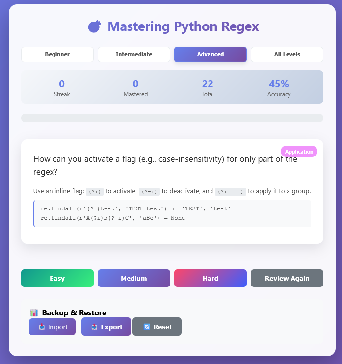

# 🎯 Python Regex Flashcards: Spaced Repetition Learning

A simple and effective front-end Web application for learning and mastering regular expressions (regex) in Python. It uses a Spaced Repetition System (SRS) to optimize long-term memorization of concepts.

## ✨ Features

*   **Spaced Repetition System (SRS)**: Cards you've mastered appear less often, while those you struggle with are presented more frequently, thus optimizing your study time.
*   **Progressive Difficulty Levels**: Choose between **Beginner**, **Intermediate**, and **Advanced** levels to tailor the learning to your current skills. An "All Levels" mode is also available.
*   **Rich and Varied Content**: Over 60 cards covering a wide range of concepts, from basic quantifiers to complex lookarounds and functions from Python's `re` module.
*   **Multiple Card Types**: For comprehensive learning, cards are categorized by type: Definition, Application, Validation, Trap, and Counter-example.
*   **Progress Tracking**: Clear statistics (Streak, Mastered Cards, Accuracy) and a visual progress bar allow you to monitor your progress in real-time.
*   **Data Persistence**: Your progress is automatically saved in your browser's `localStorage`. No need to start from scratch on each visit!
*   **Import / Export**: Save your progress to a JSON file to keep it safe or transfer it to another device.
*   **100% Client-Side**: No installation or server is required. The application runs entirely in your browser. Just open the `regex_flashcards.html` file.
*   **Responsive Design**: A clean and usable interface on both desktop and mobile.

## 🚀 How to Use

It's extremely simple:

1.  **Download** the `regex_flashcards.html` file.
2.  **Open it** in any modern web browser (Chrome, Firefox, Edge, Safari...).
3.  **Choose a level** (Beginner, Intermediate, etc.) at the top of the page.
4.  Click the **"Start"** button.
5.  Read the question, try to answer it, then click **"Show Answer"** (or click directly on the card).
6.  Evaluate your own answer by clicking one of the four assessment buttons:
    *   **Easy**: You knew the answer without hesitation.
    *   **Medium**: You got it right, but it took some thought.
    *   **Hard**: You struggled or got it wrong.
    *   **Review Again**: You had no idea what the answer was.

The application will take care of showing you the next card at the right time!

## 🧠 The Concept of Spaced Repetition

This application is not just a random quiz. It is based on the **spacing effect**, a psychological phenomenon that shows we learn more effectively when we space out our review sessions.

When you rate a card as "Easy," the application schedules it to reappear after a long interval. If you rate it as "Hard," it will come back much sooner. This process ensures that you spend more time on the concepts you haven't mastered yet, without wasting time reviewing what you already know.

## 🛠️ Tech Stack

This project is intentionally simple and focuses on the fundamentals of web development:

*   **HTML5**: For the semantic structure of the content.
*   **CSS3**: For layout (Flexbox) and styling.
*   **JavaScript (Vanilla ES6+)**: For all application logic (state management, SRS, DOM interactions) with no external framework dependencies.

## 🔮 Potential Improvements

*   Add even more cards and concepts.
*   Create a "Quick Review" mode that bypasses SRS for cramming before an interview.
*   Allow users to add, edit, or delete their own cards.
*   Develop more detailed statistics (e.g., accuracy by concept).
*   Translate the application into other languages.

## 📄 License

This project is distributed under the MIT License. See the `LICENSE` file for more details.
